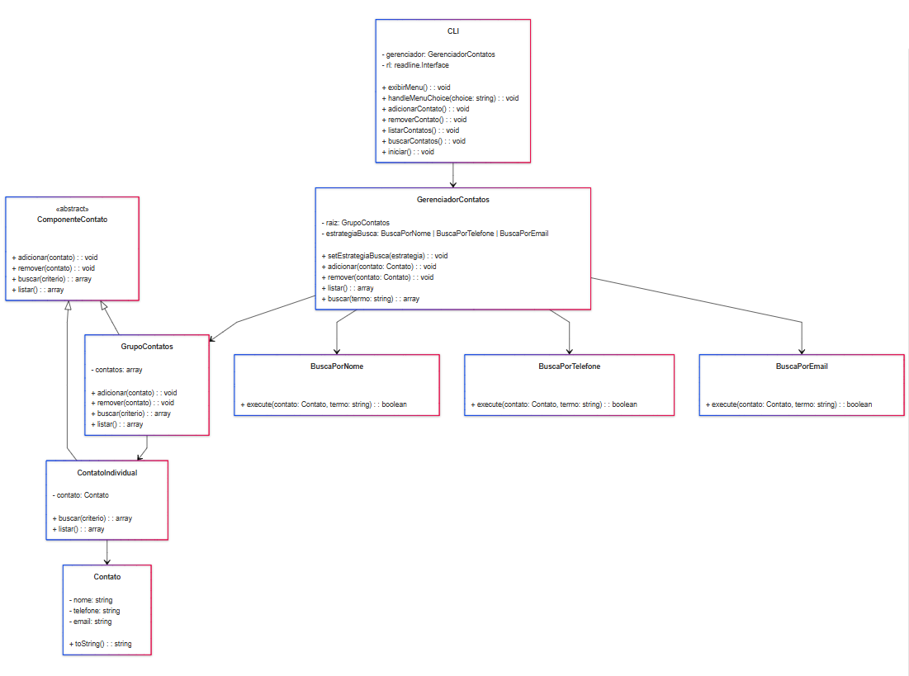

# Gerenciador de Contatos

## Descrição

Este projeto implementa um gerenciador de contatos em CLI (Command Line Interface), com funcionalidades para adicionar, remover, listar e buscar contatos. O sistema foi projetado utilizando dois padrões de design essenciais: Composite e Strategy. Esses padrões foram escolhidos para organizar os contatos em hierarquias e oferecer buscas flexíveis e expansíveis.

## Diagrama do Projeto

Abaixo está o diagrama que ilustra a estrutura do projeto e as relações entre as classes principais:



## Padrões de Design Utilizados

### **1. Padrão Composite**

O padrão **Composite** é um padrão estrutural que permite compor objetos em estruturas de árvore para representar hierarquias parte-todo. Ele facilita a manipulação uniforme de objetos compostos e individuais, permitindo que contatos e grupos de contatos sejam tratados da mesma forma.

#### **Motivo da Escolha do Padrão Composite:**

- **Facilidade de Extensão**: Permite adicionar novos tipos de componentes (como contatos empresariais ou grupos personalizados) sem alterar o código existente.
- **Organização Hierárquica**: Garante uma estrutura de árvore onde um GrupoContatos pode conter tanto ContatoIndividual quanto outros GrupoContatos, facilitando a organização flexível.

#### **Implementação:**

- **ContatoIndividual**: Representa um contato único. Ele possui as propriedades `nome`, `telefone` e `email`.
- **GrupoContatos**: Representa um grupo de contatos, podendo conter tanto contatos individuais quanto outros grupos. Implementa métodos como adicionar(), remover() e listar() de forma recursiva para suportar a hierarquia.

### **2. Padrão Strategy**

O padrão **Strategy** é um padrão comportamental que permite definir uma família de algoritmos, encapsulá-los e torná-los intercambiáveis. Ele facilita a alteração do comportamento do sistema em tempo de execução.

#### **Motivo da Escolha do Padrão Strategy:**

- **Flexibilidade nas Buscas**: Permite buscar contatos com critérios diferentes, como nome, telefone ou email, de forma independente.
- **Extensibilidade**: Novas estratégias de busca podem ser adicionadas sem modificar as existentes.
- **Isolamento de Algoritmos de Busca**: Cada algoritmo é implementado de forma independente, simplificando a manutenção.

#### **Implementação:**

- **BuscaPorNome**: Verifica se o nome do contato contém o termo de busca, ignorando maiúsculas/minúsculas.
- **BuscaPorTelefone**: Busca contatos cujo telefone contém o termo fornecido.
- **BuscaPorEmail**: Filtra contatos cujo email contém o termo, ignorando diferenças de capitalização.

Essas estratégias seguem a mesma interface (execute) e podem ser configuradas dinamicamente na classe gerenciadora de contatos. Isso permite que o critério de busca seja alterado em tempo de execução conforme a necessidade.

## Classes Principais

### **Contato**

Representa as informações básicas de um contato individual. Essa classe serve como uma estrutura de dados para armazenar e manipular as informações de um contato específico.

- **Propriedades**:
  - `nome`: Nome do contato
  - `telefone`: Telefone do contato
  - `email`: Email do contato
- **Métodos**:
  - `toString()`: Retorna uma string formatada com as informações do contato.

### **ComponenteContato**

Classe base para os componentes de contato, que pode ser estendida por ContatoIndividual e GrupoContatos. Essa classe define a interface comum para o padrão Composite, garantindo que os métodos de manipulação de contatos sejam uniformes entre as subclasses.

- **Métodos**:
  - `adicionar(contato)`: Método genérico para adicionar um contato. Deve ser sobrescrito pelas subclasses.
  - `remover(contato)`: Método genérico para remover um contato. Deve ser sobrescrito pelas subclasses.
  - `buscar(contato)`: Método genérico para buscar um contato. Deve ser sobrescrito pelas subclasses.
  - `listar(contato)`: Lista todos os contatos armazenados. Deve ser sobrescrito pelas subclasses.

### **ContatoIndividual e GrupoContatos**

**ContatoIndividual**: Extensão de ComponenteContato que representa um contato único e encapsula um objeto da classe Contato. Essa classe permite que contatos individuais sejam tratados de forma uniforme no contexto do padrão Composite.

- **Propriedades**:
  - `contato`: Instância da classe Contato.
- **Métodos**:
  - `buscar(criterio)`: Aplica o critério de busca ao contato encapsulado. Retorna o contato em uma lista se o critério for atendido, ou uma lista vazia caso contrário.
  - `listar()`: Retorna uma lista contendo apenas o contato encapsulado.

**Grupo Contatos**: Extensão de ComponenteContato que representa um grupo de contatos. Um grupo pode conter tanto instâncias de ContatoIndividual quanto outros GrupoContatos, permitindo a criação de estruturas hierárquicas. Essa classe é o núcleo do padrão Composite, permitindo a criação de grupos aninhados e a manipulação recursiva de seus componentes.

- **Propriedades**:
  - `contatos`: Array que armazena os componentes (podem ser instâncias de ContatoIndividual ou GrupoContatos).
- **Métodos**:
  - `adicionar(contato)`: Adiciona um componente (contato ou grupo) ao grupo.
  - `remover(contato)`: Remove um componente (contato ou grupo) do grupo, se encontrado.
  - `buscar(contato)`: Aplica o critério de busca recursivamente a todos os componentes do grupo, retornando uma lista com os resultados correspondentes.
  - `listar()`: Retorna uma lista contendo apenas o contato encapsulado.

### **Estratégias de Busca**

As estratégias de busca encapsulam diferentes critérios de pesquisa:

- **BuscaPorNome**: Localiza contatos pelo atributo nome.
- **BuscaPorTelefone**: Localiza contatos pelo atributo telefone.
- **BuscaPorEmail**: Localiza contatos pelo atributo email.

### **CLI**

A interface de linha de comando (CLI) fornece uma interação simplificada com o sistema:

1. Adicionar Contato: Adiciona contatos ou grupos.
2. Remover Contato: Remove contatos ou grupos específicos.
3. Listar Contatos: Exibe contatos e grupos cadastrados.
4. Buscar Contatos: Realiza buscas dinâmicas com base nas estratégias configuradas.

## Dependências

Este projeto utiliza as seguintes dependências para desenvolvimento e manutenção do código:

### **Dependências de Desenvolvimento**

As principais dependências utilizadas incluem:

ESLint e Prettier: Para garantir qualidade e consistência no código.
Plugins adicionais: Para integração eficiente entre ferramentas e suporte ao estilo de código desejado.

## Como Executar

Para iniciar o gerenciador de contatos, execute o seguinte comando no terminal:

1. Clone o repositório na sua máquina local:

   ```bash
   git clone https://github.com/marjorymell/gerenciador-contatos
   ```

2. Abra o terminal e roda `npm install` para instalar as dependências necessárias.
3. Após instalar, rode `npm start` para interagir com o sitema.

Isso inicializa o sistema e permite que você interaja com as funcionalidades de adicionar, remover, listar e buscar contatos. O sistema oferece uma interface simples de linha de comando onde você pode escolher qual ação deseja realizar.

## Conclusão

O uso combinado dos padrões Composite e Strategy trouxe flexibilidade e extensibilidade ao sistema:

- **Composite**: Suporte a hierarquias dinâmicas e organização eficiente de contatos.
- **Strategy** Busca personalizável e expansível, preparada para novas estratégias no futuro.

Com esses padrões, o sistema é robusto, escalável e fácil de manter, pronto para atender a novos requisitos sem impactar o código existente.
